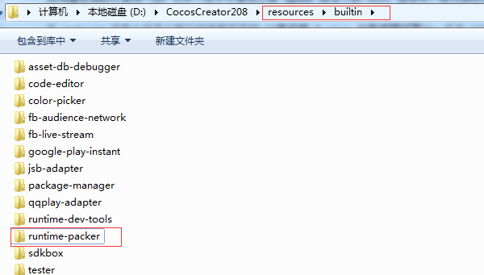
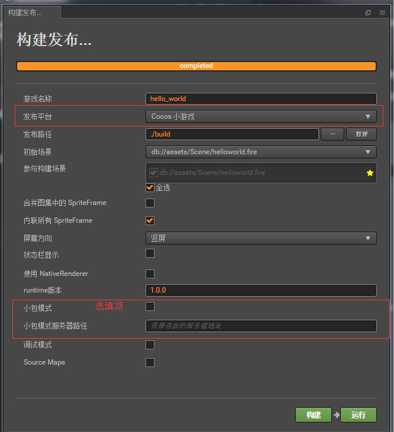
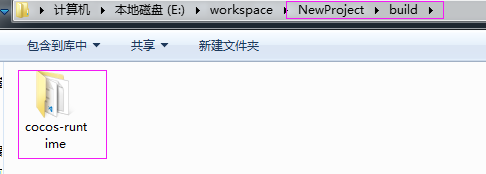
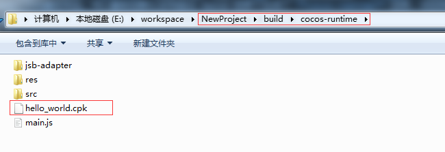

# 使用老版Creator打包

一、下载 [**runtime-packer**](http://test-runtime.cocos.com/cocos-runtime-demo/creator/CocosCreator-v2.0.8-runtime-packer-190301.zip) 解压后放到 Creator 编辑器安装路径下的 **Resources/builtin** 目录下即可。

二、使用 Cocos Creator 打开需要发布的项目工程，在 **构建发布** 面板的 **发布平台** 中选择 **Cocos 小游戏**。 

**小包模式和小包模式服务器路径** 该项为选填项。小游戏资源可以通过网络请求加载。**小包模式** 就是帮助用户将脚本文件保留在快游戏包内，其他资源则上传到远程服务器，根据需要从远程服务器下载。而远程资源的下载、缓存和版本管理，Creator 已经帮用户做好了。用户需要做的是以下两个步骤：

1、构建时，勾选 **小包模式**，填写 **小包模式服务器路径**。然后点击 **构建**。

2、构建完成后，点击 **发布路径** 后面的 **打开** 按钮，将发布路径下的 **cocos-runtime/res** 目录上传到小包模式服务器。例如：默认发布路径是 build，则需要上传 **build/cocos-runtime/res** 目录。

此时，构建出来的 cpk 将不再包含 res 目录，res 目录里的资源将通过网络请求从填写的 **小包模式服务器路径** 上下载。

构建发布 上面的 **发布平台** 设置完成后，点击 **构建**。构建完成后点击 **发布路径** 后面的 **打开** 按钮来打开构建发布包。可以看到在默认发布路径 build 目录下生成了 **cocos-runtime** 目录，该目录就是导出的 cocos 小游戏工程目录。

并且在**/build/cocos-runtime/**目录下生成所需要的 **cpk**包。

