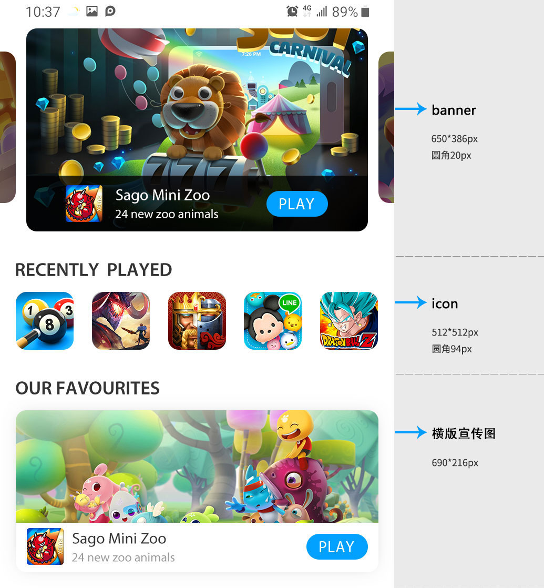
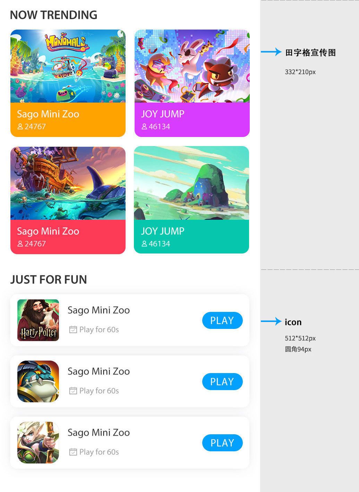

# 素材规范

即刻玩小游戏平台素材共包含**ICON**、**BANNER**、 **横版卡片、田字格卡片四种**，规范如下：

## ICON规范

* icon输出尺寸为**512\*512**，半径为**94px**，输出文件不得超过**120kb**

## BANNER规范

* banner的整体尺寸为**650\*386，**圆角半径为**20px**
* 输出文件不得超过**120kb**
* banner的构图需要严谨且用色考究

## 横版宣传图

* 单张游戏素材的整体尺寸为**696\*216，不要圆角**
* 输出文件不得超过**120kb**
* 素材由整张原画素材+黑色遮罩+游戏logo组成，可参考素材规范模板
* 原始图片保持构图完美，用色合理

## 田字格宣传图

* 单张游戏素材的整体尺寸为**332\*210，不要圆角**
* 输出文件不得超过**120kb**

## 素材规范模板下载

**点我下载**

