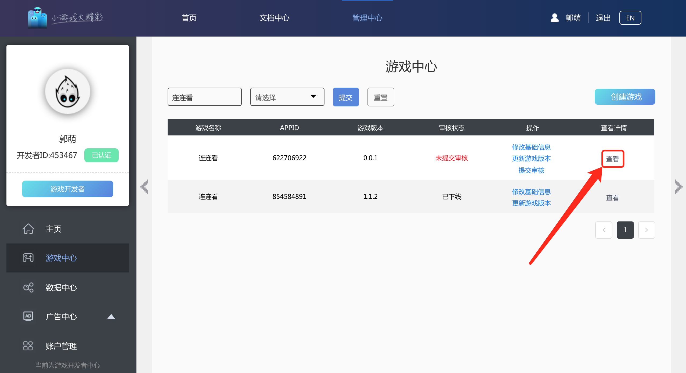

# 获取对接参数

开发者在接入SDK前需要从开放平台获取**gameId**、**gameKey**、**gameSecret**三个参数，获取方法如下：

1、访问即刻玩小游戏平台[**global-gamebox.cocos.com**](http://global-gamebox.cocos.com/)**,**注册Cocos开发者账号，之前注册过的开发者可以直接使用。

2、提交公司相关资质。

3、公司资质审核通过后，创建游戏并查看接入参数

